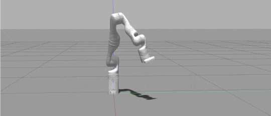

# Kinova Klampt IK

An implementation of [Klampt](https://github.com/krishauser/Klampt) Inverse Kinematic (IK) solution for [Kinova Gen 3 7-DOF robot arm](https://www.kinovarobotics.com/en/products/gen3-robot), including position control and calculated velocity control.

## Dependencies

This repository has been developed and tested in Ubuntu 18.04 and ROS Melodic only. Other version may work but it is not guaranteed.

The repository is built on [Klampt](https://github.com/krishauser/Klampt), which provides robotics solutions for motion planning, inverse kinematics, etc. We are using its [IK module](http://motion.cs.illinois.edu/software/klampt/latest/pyklampt_docs/Manual-IK.html) for position control and velocity control of the [Kinova Arm](https://www.kinovarobotics.com/en/products/gen3-robot).  Klampt uses a **numerical** IK solver that iteratively minimizes the error between the current link transform and the goals.

To install [Klampt](https://github.com/krishauser/Klampt), quick start (Python API only):

- `pip install klampt` (or `pip3 install klampt`)

To run a visualization (you may need to replace `pip` with `pip3` and `python` with `python3`):

- `pip install PyOpenGL`
- `pip install PyQt5`

If you only need the IK module, having python API is enough. If you need more other features of Klampt, please follow its [Installation instructions](https://github.com/krishauser/Klampt) for more details.

## Running

#### Launch the codes

`roslaunch kinova_klampt_ik kinova_gen3_ik.launch`

The launch files launches 3 nodes. The first node is for gen3 position IK solution. The second node is for gen3 velocity IK solution. And the last node, which is optional and may vary depending on the platforms, is a node to convert the IK solution to readable input for the robot.

#### Position IK Node

- Position IK node provides two position IK modes, point IK (3 DOF) and fixed IK (6 DOF). To send a pose to the IK solver, you can publish to topics

  `/kinova_gen3_ik/point_ik`, `geometry_msgs/Point`

  `/kinova_gen3_ik/fixed_ik`, `geometry_msgs/Pose`

- To get the solution, please subscribe to topic

  `/kinova_gen3_ik/result_config`, `std_msgs/Float64MultiArray`

  Please note that as the Klampt is computing a numerical solution that minimizes the error. Even though a given pose is not valid, a solution is still given as the closest pose. The subscribed topic will return an IK solution array of length 8, in which the <u>first 7 elements are the joint angles</u>, and the <u>last element indicates if this pose is valid</u> (1 is valid, and 0 is not). 

  By checking the last element of the message, you could decide if you would like to use this solution. It's recommended not to if you are using a physical robot, as these solutions are likely close to singularity, prone to collision or unintended weird poses.

- There are two more settings of the solver you can change.

  To change the initial guess angles of the solver

  `/kinova_gen3_ik/set_init_angles`, `std_msgs/Float64MultiArray `

  To change the target link to others (e.g. "camera")

  `/kinova_gen3_ik/set_ik_link`, `std_msgs/String `

#### Velocity IK Node

- Velocity IK node computes the future position in the next time step given a velocity and compute the corresponding position IK solution.

  `/kinova_gen3_vel_ik/cmd_vel`, `geometry_msgs/Twist`

- To get the solution, please subscribe to topic

  `/kinova_gen3_vel_ik/result_config`, `std_msgs/Float64MultiArray`

  The information of this message is the same as the position IK.

- There are two more settings of the solver you can change.

  To change the current pose or angles of the robot

  `/kinova_gen3_vel_ik/set_current_angles`, `geometry_msgs/Float64MultiArray `

  `/kinova_gen3_vel_ik/set_current_pose`, `geometry_msgs/Pose `

  Please note that the velocity IK is a fake velocity control, computing future position IK at each time step. And robot joint angles in Klampt solver may not be the same as the robot you are using. So it's important to set the pose in Klampt the same as the pose your robot is now before using velocity IK. It's also possible that you need to set the pose to match your robot's pose during your use.

  To change the target link to others (e.g. "camera")

  `/kinova_gen3_vel_ik/set_ik_link`, `std_msgs/String `

